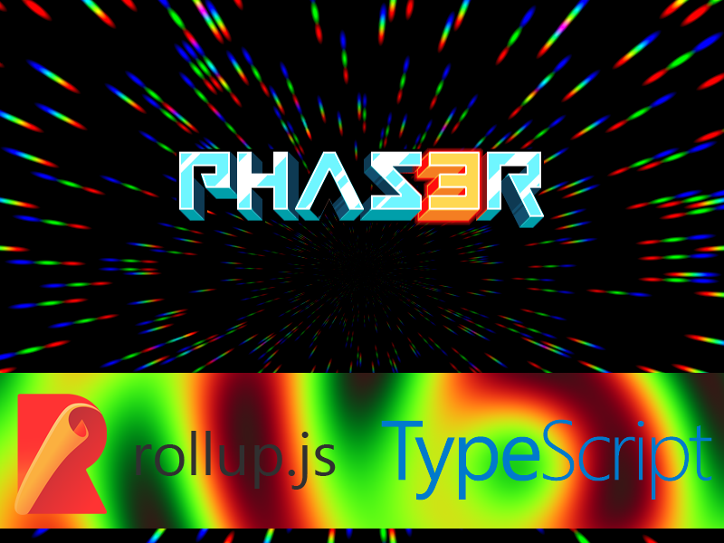

# Phaser 3 TypeScript Project Template

This quick-start project template combines Phaser 3 with [TypeScript](https://www.typescriptlang.org/) and uses [Webpack](https://webpack.js.org) for bundling.

**The official website takes 20 seconds and this one only takes 4 seconds**

**Please enjoy it**

## Requirements

[Node.js](https://nodejs.org) is required to install dependencies and run scripts via `npm`.

## Available Commands

| Command         | Description                                                                       |
| --------------- | --------------------------------------------------------------------------------- |
| `npm install`   | Install project dependencies                                                      |
| `npm run start` | Build project and open web server running project, watching for changes           |
| `npm run build` | Builds code bundle with production settings (minification, no source maps, etc..) |

## Writing Code

After cloning the repo, run `npm install` from your project directory. Then, you can start the local development
server by running `npm run start`. The first time you run this you should see the following demo run:

After starting the development server with `npm run start`, you can edit any files in the `src` folder
and Webpack will automatically recompile and reload your server (available at `http://localhost:8080`
by default).

## Configuring Webpack

- Edit the file `webpack.config.js` to edit the development build.
- Edit the file `webpack.prod.js` to edit the distribution build.

You will find lots of comments inside the rollup config files to help you do this.
